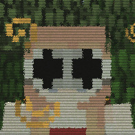
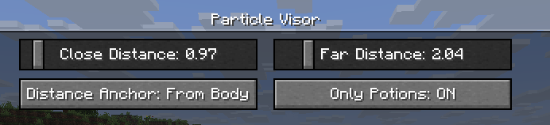

# Particle Visor

Removes/fades particles based on distance

## Features

- Hides particles very close to the camera (so potion particles won't get in your way in fights)
- Lots of customization

## Configuration
Particle Visor uses [ukulib](https://modrinth.com/mod/ukulib) for its configuration. 

You can either: 
- Go to the Options menu, click the small, square button to the right of Credits and Attribution, and go into Particle Visor.
- Open [Mod Menu](https://modrinth.com/mod/modmenu) and open the configuration menu from there

- `Close Distance`: The farthest distance at which particles will still be visible. Anything closer than this won't render at all.
- `Far Distance`: The closest distance at which particles will be faded. Anything in between this value and `Close Distance` will be faded. (you can set this to be the same as `Close Distance` to make particles "pop in")
- `Distance Anchor`: The point on your player model where the distance will be determined
- - `From Eyes`: Distance determined from the "eye level"
- - `From Body`: Distance will be the same regardless of whether the particle is at your eyes or your feet, like a cylinder (though anything above or below that will be accounted for)
- - `From Feet`: Distance determined from the character's feet
- `Only Potions`: Anything not considered a "spell particle" will be unaffected by the mod.

## Compatibility

I've verified that the mod works with [Sodium](https://modrinth.com/mod/sodium) and [Particle Core](https://modrinth.com/mod/particle-core) (and whatever else is in [uku's pvp modpack](https://modrinth.com/project/particle-visor)), so I don't think there will be many incompatibilities. Feel free to [make an issue](https://github.com/sylvxa/particle-visor/issues/new) if you find any!